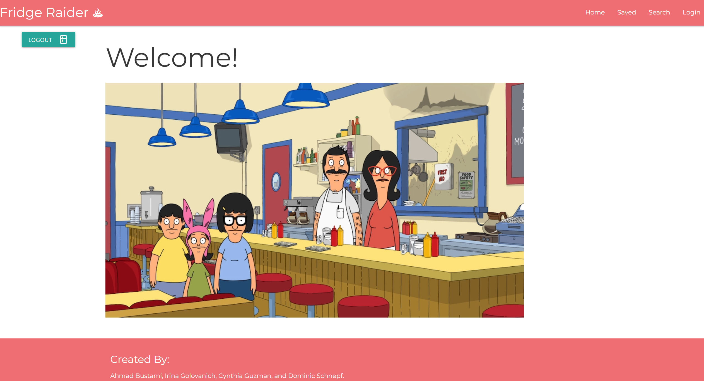
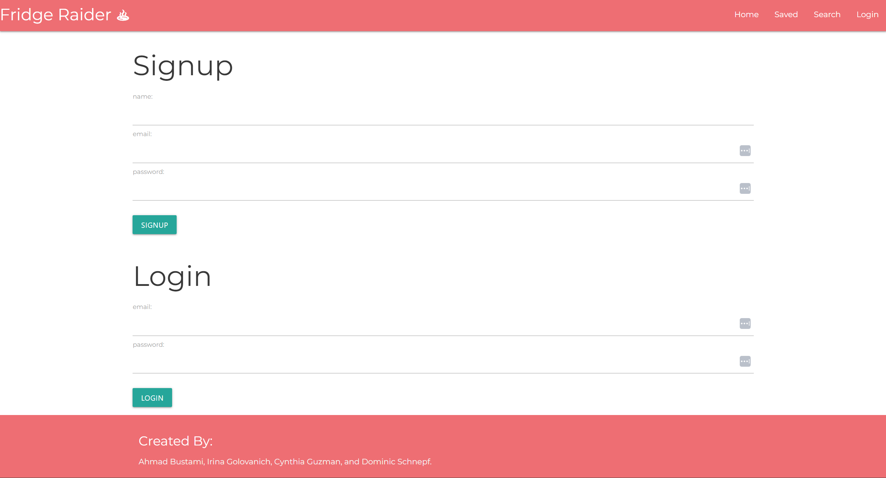
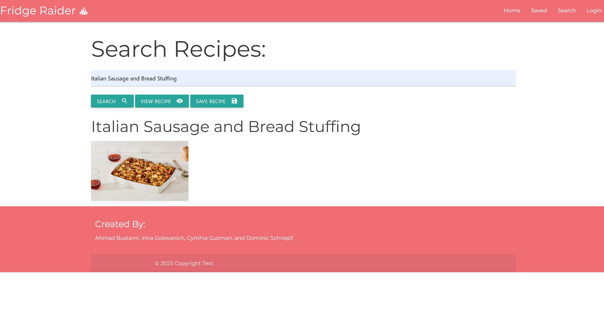
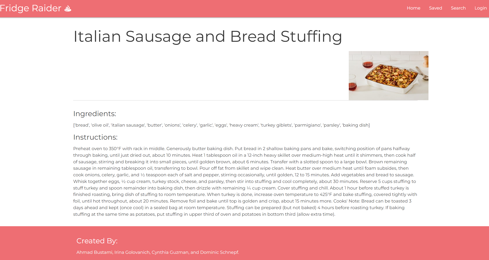

#   **FridgeRaider**: Recipe App

 

### **Description**
FridgeRaider was created to help save time and ease the decision-making process when it comes to mealprep. The app allows users to search for recipes by inputting an ingredient into the dropdown search bar and receiving a list of recipes back. It allows users to create a profile where they can search for, save, and delete recipes. The app is designed to be simple to navigate and use. 
 

### **Table of Contents**
N/A
 

### **Installation and Running**
[Click Here](https://github.com/Dschnepf7/Recipe-Database) for the GitHub repository. 
 

### **Use**
Check out our [Heroku LiveLink](https://recip-db.herokuapp.com/). 
 

You may use the login details below to test **FridgeRaider**: 
 

**username:** test4         
**email:** test4@test.com             
**password:** pass1234
 
 

**Home Page**
 

 

**Login/Sign-Up Page**
 

 

**Search Page**
 

 

**Recipe Page**
 

### **Credits**
- Cynthia Guzman - [Github](https://github.com/cguzman37)
 

- Dominic Schnepf - [Github](https://github.com/Dschnepf7)
 

- Irina Golovanich - [Github](https://github.com/irkag22)
 

- Ahmad Bustami - [Github](https://github.com/ahmad92894)
 

### **License**

